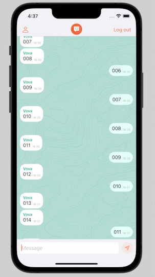

## SimpleChat
This app was made to learn the [Firebase](https://firebase.google.com) and to practice animation. It's just a single chat which can be used after registration and verification.

## I practised
- MVC and Delegate patterns
- Working with email authentication
- Using the Firebase cloud database
- Drawing shapes
- Animating everithing I could find to animate
- Making custom classes

## The app in the action
### Animation in the chat
<table>
  <tr align="center">
    <td width="250">Receiving new messages</td>
    <td width="250">Keyboard animation</td>
    <td width="250">Loading the chat history</td>
  </tr>
  <tr align= "center">
    <td width="250"></td>
    <td width="250"></td>
    <td width="250"></td>
  </tr>
  <tr align= "center">
    <td width="250">Sending a message</td>
    <td width="250">Additing new rows to the text view</td>
    <td width="250">Showing new messages</td>
  </tr>
  <tr align= "center">
    <td width="250"></td>
    <td width="250"></td>
    <td width="250"></td>
  </tr>
 </table>

### View controller animation
<table>
  <tr align="center">
    <td width="250">Transitions</td>
    <td width="250">Keyboard appearence</td>
  </tr>
  <tr align= "center">
    <td width="250"></td>
    <td width="250"></td>
  </tr>
 </table>

### UI animation
<table>
  <tr align="center">
    <td width="250">Wrong password</td>
    <td width="250">Wrong email</td>
    <td width="250">Password requirements</td>
  </tr>
  <tr align= "center">
    <td width="250"></td>
    <td width="250"></td>
    <td width="250"></td>
  </tr>
    <tr align="center">
    <td width="250">Filling text fields</td>
  </tr>
  <tr align= "center">
    <td width="250"></td>
  </tr>
 </table>

### Some alerts
<table>
  <tr align="center">
    <td width="250">Question about verification</td>
    <td width="250">Bad internet connection</td>
    <td width="250">Successes</td>
  </tr>
  <tr align= "center">
    <td width="250"></td>
    <td width="250"></td>
    <td width="250"></td>
  </tr>
    <tr align="center">
    <td width="250">Check your email</td>
  </tr>
  <tr align= "center">
    <td width="250"></td>
  </tr>
 </table>

## UI Images

  
   
  
  
  

## Test this app
1. To test this app you need to creat a new project in the [Firebase console](https://console.firebase.google.com/u/0/).
2. Setup this project for iOS.
3. Add authentication and Firestore Database to your project.
4. Download `GoogleService-Info.plist`.
5. Add `GoogleService-Info.plist` to the Xcode file.
