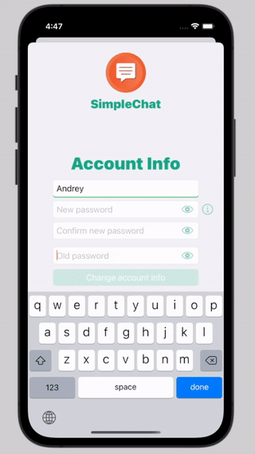

## SimpleChat
This app was made to learn the [Firebase](https://firebase.google.com) and to practice animation. It's just a single chat which can be used after registration and verification.

## I practised

## The app in the action

## Images of UI

  
   
  
  
  

### Animation in the chat
<table>
  <tr align="center">
    <td width="300">Receiving new messages</td>
    <td width="300">Keyboard animation</td>
    <td width="300">Loading the chat history</td>
  </tr>
  <tr align= "center">
    <td width="300"></td>
    <td width="300"></td>
    <td width="300"></td>
  </tr>
  <tr align= "center">
    <td>Sending a message</td>
    <td>Additing new rows to the text view</td>
    <td>Showing new messages</td>
  </tr>
  <tr align= "center">
    <td></td>
    <td></td>
    <td></td>
  </tr>
 </table>

### View controller animation
<table>
  <tr align="center">
    <td width="300">Transitions</td>
    <td width="300">Keyboard appearence</td>
  </tr>
  <tr align= "center">
    <td width="300"></td>
    <td width="300"></td>
  </tr>
 </table>

### UI animation
<table>
  <tr align="center">
    <td width="300">Wrong password</td>
    <td width="300">Wrong email</td>
    <td width="300">Password requirements</td>
  </tr>
  <tr align= "center">
    <td width="300"></td>
    <td width="300"></td>
    <td width="300"></td>
  </tr>
    <tr align="center">
    <td width="300">Filling text fields</td>
  </tr>
  <tr align= "center">
    <td width="300"></td>
  </tr>
 </table>

### Some alerts

<table>
  <tr align="center">
    <td width="300">Question about verification</td>
    <td width="300">Bad internet connection</td>
    <td width="300">Successes</td>
  </tr>
  <tr align= "center">
    <td width="300"></td>
    <td width="300"></td>
    <td width="300"></td>
  </tr>
    <tr align="center">
    <td width="300">Check your email</td>
  </tr>
  <tr align= "center">
    <td width="300"></td>
  </tr>
 </table>

